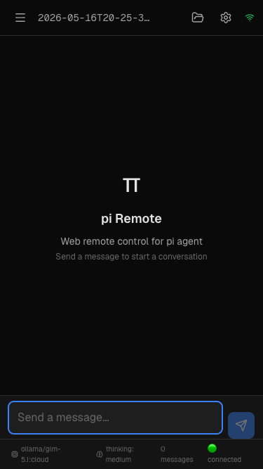

# PiWeb

[](https://github.com/myshytf/PiWeb/actions/workflows/ci.yml)
[](LICENSE)
[](package.json)

**언어:** [English](README.md) | 한국어

[`pi` 코딩 에이전트](https://www.npmjs.com/package/@earendil-works/pi-coding-agent)를 위한 모바일 친화적인 웹 인터페이스입니다.  
HTTP + WebSocket 서버를 실행하고 정적 Next.js UI를 제공하여 브라우저에서 pi 세션을 제어할 수 있습니다.



## 기능

- 실시간 WebSocket 스트리밍을 지원하는 pi 에이전트 채팅 UI
- 세션 목록, 전환, 새 세션 생성 및 백그라운드 세션 상태 업데이트
- 활성 프로젝트의 파일 브라우저 및 워크스페이스 도구
- 모델/사고 수준 설정, 슬래시 명령 브릿지, 토큰 사용량 표시
- PWA 자산 및 작업 완료 시 Web Push 알림 (선택 사항)
- 내장 인증, 동일 출처 API 보호, 요청 크기 제한, 파일 루트 제한

## 소스 코드로 빠르게 시작하기

```bash
git clone https://github.com/myshytf/PiWeb.git
cd PiWeb
npm ci
npm run setup:frontend
npm run build
npm start -- --cwd /path/to/your/project
```

서버가 출력하는 URL(보통 `http://127.0.0.1:9876`)을 브라우저에서 여세요.

포트, 로그인 정보, 공개 터널을 한 번에 저장하려면 설정 마법사를 실행하세요:

```bash
npm start -- setup
```

최초 실행 시 `~/.pi/agent/pi-web-credentials.json` 파일이 생성되고 비밀번호가 한 번 출력됩니다.  
직접 비밀번호를 설정하려면:

```bash
PI_WEB_USERNAME=piweb PI_WEB_PASSWORD='길고-안전한-비밀번호' npm start -- --cwd .
```

## npm 패키지로 설치

```bash
npm install -g @minyongchoi94/pi-web
pi-web setup
pi-web --cwd /path/to/your/project
```

또는 글로벌 설치 없이:

```bash
npx @minyongchoi94/pi-web setup
npx @minyongchoi94/pi-web --cwd /path/to/your/project
```

> `pi-web` 이름의 npm 패키지는 이미 다른 maintainer가 사용 중이므로,  
> 이 프로젝트는 `@minyongchoi94` 스코프로 퍼블리시됩니다.

## CLI 옵션

```bash
pi-web --help
```

| 옵션 | 환경변수 | 기본값 | 설명 |
| --- | --- | --- | --- |
| `setup` | — | — | 포트, 인증 정보, 설정 파일, 터널 자동 시작을 저장하는 설정 마법사 |
| `config` | — | — | 저장된 설정 파일 출력 |
| `--config` | `PI_WEB_CONFIG_FILE` | `~/.pi/agent/pi-web-config.json` | 저장된 설정 파일 경로 |
| `--port` | `PI_WEB_PORT` | `9876` | HTTP/WebSocket 포트 |
| `--host` | `PI_WEB_HOST` | `127.0.0.1` | 바인드 호스트. LAN 접근은 `0.0.0.0` 사용 |
| `--cwd` | `PI_WEB_CWD` | 현재 디렉토리 | pi 세션의 프로젝트 디렉토리 |
| `--agent-dir` | `PI_WEB_AGENT_DIR` | `~/.pi/agent` | pi 에이전트 설정/세션 디렉토리 |
| `--credentials-file` | `PI_WEB_CREDENTIALS_FILE` | `~/.pi/agent/pi-web-credentials.json` | 로그인 인증 파일 |
| `--username` | `PI_WEB_USERNAME` | `piweb` | 로그인 사용자 이름 |
| `--password` | `PI_WEB_PASSWORD` | 자동 생성 | 로그인 비밀번호 |
| `--no-auth` | `PI_WEB_NO_AUTH=1` | 인증 켜짐 | 인증 비활성화. 신뢰할 수 있는 네트워크에서만 사용 |
| `--tunnel` | `PI_WEB_TUNNEL` | 저장된 설정 / 없음 | `cloudflared` 또는 `ngrok` 공개 터널 시작 |
| `--no-tunnel` | — | 꺼짐 | 저장된 터널 자동 시작을 이번 실행에서만 비활성화 |
| `--https` | `PI_WEB_HTTPS=1` | 꺼짐 | `~/.pi/certs/`의 mkcert 인증서로 HTTPS 제공 |

추가 환경변수:

| 환경변수 | 설명 |
| --- | --- |
| `PI_WEB_CREDENTIALS_FILE` | 생성된 인증 파일 경로 재정의 |
| `PI_WEB_CONFIG_FILE` | 저장된 설정 파일 경로 재정의 |
| `PI_WEB_TUNNEL` | 공개 터널 자동 시작: `cloudflared`, `ngrok`, 또는 `none` |
| `PI_WEB_ALLOWED_ORIGINS` | API CORS에 허용할 추가 출처 (쉼표 구분) |
| `PI_WEB_ALLOWED_ROOTS` | 파일 API가 허용하는 파일시스템 루트 (쉼표 구분) |
| `PI_WEB_TRUST_PROXY=1` | 인증 속도 제한을 위해 리버스 프록시 IP 헤더 신뢰 |
| `PI_WEB_COOKIE_SECURE=1` | HTTPS 프록시 뒤에서 인증 쿠키 Secure 플래그 강제 |
| `PI_WEB_VAPID_SUBJECT` | Web Push VAPID 주체 (예: `mailto:you@example.com`) |

`.env.example` 파일을 복사하여 로컬 템플릿으로 사용할 수 있습니다.

## 원격, LAN, 공개 터널 접속

PiWeb은 기본적으로 로컬 전용(`127.0.0.1`)으로 실행됩니다. 같은 네트워크의 휴대폰이나 태블릿에서 접속하려면:

```bash
PI_WEB_PASSWORD='길고-안전한-비밀번호' pi-web --host 0.0.0.0 --port 9876 --cwd .
```

로컬 바인드 호스트를 바꾸지 않고 인터넷에서 접근 가능한 URL을 만들려면 터널을 사용하세요:

```bash
pi-web --tunnel cloudflared --cwd .
```

무료로 쓰기 쉬운 기본 추천 옵션은 `cloudflared` quick tunnel입니다. 필요하면 먼저 설치하세요:

```bash
brew install cloudflare/cloudflare/cloudflared
```

ngrok 계정/토큰이 이미 설정되어 있다면 ngrok도 사용할 수 있습니다:

```bash
pi-web --tunnel ngrok --cwd .
```

터널 자동 시작을 저장하려면 설정 마법사를 실행하세요:

```bash
pi-web setup
```

보안 주의사항:

- 공개 터널을 사용할 때는 특히 인증을 항상 켜두세요.
- 자동 생성된 강력한 인증 정보 또는 직접 만든 긴 랜덤 비밀번호를 사용하세요.
- 파일시스템 접근을 제한하려면 `PI_WEB_ALLOWED_ROOTS`를 설정하세요.
- `.env`, 인증 JSON, TLS 키, 푸시 구독, pi 세션 상태는 절대 커밋하지 마세요.

## 개발

```bash
npm ci
npm run setup:frontend
npm run dev          # 백엔드 :9876
npm run dev:frontend # API/WS 리라이트가 있는 Next 개발 서버
```

유용한 검사 명령어:

```bash
npm run typecheck
npm run build
npm run pack:dry-run
npm run release:check
```

E2E 테스트는 실행 중인 서버가 필요합니다:

```bash
npm run test:server
npm run test:e2e
```

## 패키지 구성

npm 패키지는 의도적으로 작게 유지됩니다. `package.json#files`는 다음만 포함합니다:

- `dist/` TypeScript 빌드 출력물
- `frontend/out/` 정적 UI 내보내기
- 영문/한국어 README, 라이선스, 변경 로그, 보안/기여 문서, 설치 후 안내 스크립트, README 스크린샷

전체 소스 코드, 테스트, 디자인 노트는 GitHub을 통해 배포됩니다.

## API 개요

- `GET /api/health` — 서버 상태 확인
- `GET /api/sessions`, `POST /api/sessions/new`, `POST /api/sessions/switch` — 세션 관리
- `GET /api/messages`, `POST /api/messages/prompt`, `POST /api/messages/abort` — 메시지
- `GET /api/settings`, `POST /api/settings/model`, `POST /api/settings/thinking` — 설정
- `GET /api/files/list`, `GET /api/files/read`, `POST /api/files/write` — 파일
- `GET /api/tools`, `GET /api/agent/state` — 도구/상태
- `GET /api/events/stream` 및 `WS /ws` — 실시간 이벤트
- `GET/POST /api/push/*` — Web Push 설정

## 퍼블리싱

GitHub 및 npm 릴리스 체크리스트는 [`docs/PUBLISHING.md`](docs/PUBLISHING.md)를 참고하세요.

간단 버전:

```bash
npm ci
npm run setup:frontend
npm run release:check
git add .
git commit -m "릴리스 준비"
git push origin main
git tag v0.2.1
git push origin v0.2.1
npm publish --access public
```

## 기여

[`CONTRIBUTING.md`](CONTRIBUTING.md)를 참고하세요. 보안 관련 사항은 [`SECURITY.md`](SECURITY.md)에 있습니다.

## 라이선스

MIT © 2026 Dylan Choi

---

🇺🇸 [English documentation](README.md)
